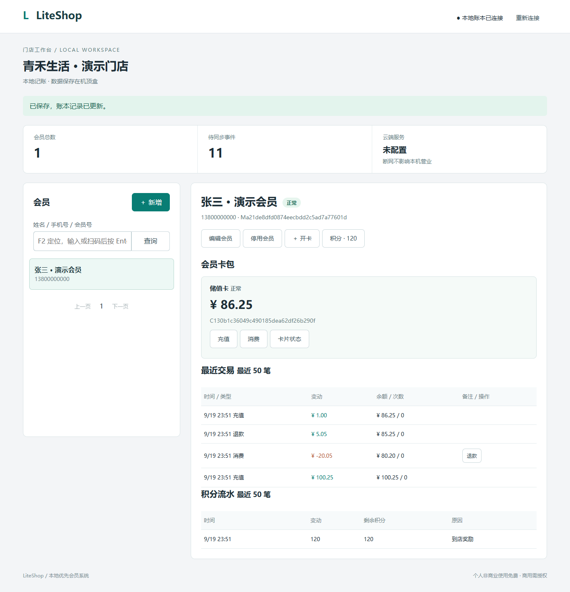

# 本地 Web 工作台

## 产品运行方式与开发预览

门店使用机顶盒 APK：内置页面通过原生 Bridge 直接访问本机 SQLite，无需电脑和 HTTP 服务。以下 Python 服务仅为开发测试工具，与安卓数据库相互独立。

## 开发预览（Python 3.11+）

在仓库根目录运行，无须安装 Python 第三方依赖：

```powershell
cd E:\code\liteshop
python -m apps.web.server --shop-name "我的门店"
```

打开 http://127.0.0.1:8765 ，输入控制台显示的访问密钥。默认只监听本机，数据库保存在 `data/liteshop.sqlite`。重复启动沿用已有数据；`--shop-name` 只在首次创建数据库时生效。按 Ctrl+C 停止。可以用 `--db` 指定独立测试数据库。

HTTP 测试服务默认仅监听本机；不要映射到公网。Android APK 不连接此服务。当前操作人为初始化 Owner，员工权限后续实现。

## 使用流程

1. 新增会员，可填写手机号与备注；按姓名、手机号或完整会员号搜索，Enter 提交，50 条一页。
2. 选择会员，开通储值卡或次卡。
3. 储值卡充值/消费以元输入，界面严格解析为整数分；次卡充次/扣次使用整数。
4. 从原消费流水发起部分或全部退款；后端核对累计已退数量。
5. 积分填写正数增加、负数扣除，必须填写原因。
6. 可编辑/停用会员，以及挂失/停用/恢复会员卡。详情显示最近 50 笔交易和积分流水。

Android 操作调用原生 LocalStore；浏览器开发预览调用 Python ShopService，账本与同步事件同事务写入。页面使用 HTML/CSS/ES5，无 CDN、fetch、Promise 或构建依赖。键盘 Tab/Enter、扫码枪 HID 键盘输入可用，F2 可定位会员搜索，弹窗支持 Escape 和焦点循环。

## 中断与恢复

- 机顶盒断网：本机 SQLite 继续交易，待同步事件累积；配置 Cloud API 后网络恢复时按原事件 ID 后台重试上传。
- 本机数据库忙、磁盘错误或响应丢失：保留完整原请求及 request_id，修复后点击「重试原请求」，避免重复扣款。
- 待确认请求保存在本机 WebView localStorage，账本与幂等回执保存在 SQLite。刷新或重启应用后可恢复确认；不要清除应用数据。
- 浏览器开发预览依赖测试 HTTP 服务，停止该服务只影响浏览器预览，不影响机顶盒营业。
- 浏览器测试密钥保存在 sessionStorage；APK 无需此密钥或服务器地址。

## 本地 API v1

仅开发 HTTP 服务的接口要求 `Authorization: Bearer <终端密钥>`，不提供跨域 CORS。返回 `{"ok":true,"data":...}` 或 `{"ok":false,"error":{"code":"...","message":"..."}}`。

| 方法与路径 | 说明 |
| --- | --- |
| GET /api/v1/status | 门店、设备、会员总数、待同步数、云端配置状态 |
| GET /api/v1/card-types | 储值/次卡类型 |
| GET /api/v1/members?q=&offset=0 | 会员搜索，50 条一页 |
| GET /api/v1/members/{id} | 资料、卡包、积分、最近交易与积分流水 |
| POST /api/v1/commands/create-member | request_id, name, phone?, remark? |
| POST /api/v1/commands/update-member | request_id, member_id, version，以及 name/phone/remark/status |
| POST /api/v1/commands/open-card | request_id, member_id, card_type_id, expire_at? |
| POST /api/v1/commands/card-status | request_id, card_id, version, status |
| POST /api/v1/commands/transact | request_id, card_id, kind, amount?, times?, source_id?, remark? |
| POST /api/v1/commands/points | request_id, member_id, points, remark |

Android Bridge 使用下列路径并省略 /api/v1/，在本机执行且不开放 HTTP 端口。POST 仅接受 JSON 对象（HTTP 最多 16 KiB，原生桥最多 16384 字符）。amount 为整数分；times/points 为整数；expire_at 为毫秒时间戳。同一 request_id 必须使用完全相同的参数。缺少或无效参数为 400，未认证为 401，跨站为 403，记录不存在为 404，幂等或版本冲突为 409，数据库暂不可用为 503。

**微信小程序 API 独立预留**：开发测试密钥不得用于微信会员端。本文件的写操作仅供门店终端使用；微信登录、会员绑定、只读余额/积分/卡包及预约遵循 [API_WECHAT_MINIPROGRAM.md](API_WECHAT_MINIPROGRAM.md)。Cloud API 已实现内部会员投影查询骨架，正式微信登录和小程序客户端尚未实现。

## 验证

```powershell
python -m unittest discover -s tests -v
node --check apps/web/public/app.js
```

测试覆盖核心账本、HTTP 工作流、并发重试、鉴权、退款回滚、资料版本冲突和数据库重启持久化。Android 4.4 实机、低内存和断电恢复仍需按终端文档验收。

### 可选浏览器验收

浏览器脚本在 Windows Edge 无界面模式验证会员、开卡、充值消费退款、积分、800px 布局与原生桥模拟验证，并用 Acorn 按 ES5 语法解析脚本。实际 Android API 19 验收仍需真机。

运行可重复的验收脚本（测试数据使用独立临时数据库）：

    npm install --prefix "$env:TEMP/liteshop-validation" --no-save playwright acorn
    node tests/browser_smoke.cjs

默认 Windows 浏览器为 Edge，可用 LITESHOP_BROWSER 指定可执行文件；LITESHOP_TEST_NODE_MODULES 可指定测试依赖路径。测试覆盖提交成功但响应丢失、重载后恢复、认证失败保留原请求、原请求重试只记一笔，以及用户输入 HTML 转义。它不会操作默认营业数据库。

工作台截图：

请求未执行前的认证/路由失败也保留待确认记录。只有响应明确表示成功，或 error.definitive 为 true 的业务拒绝，才清除该记录。
